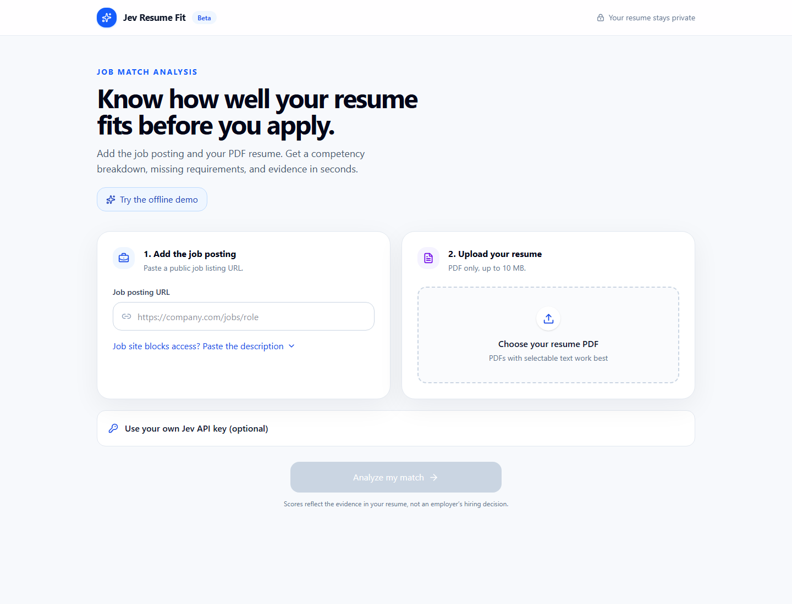
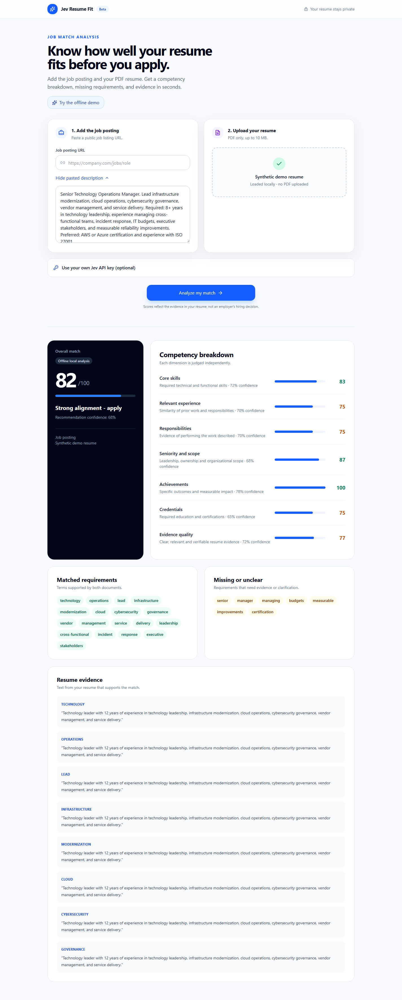

# Jev Resume Fit

Jev Resume Fit is a privacy-first, self-hosted resume-to-job comparison tool. It extracts selectable text from a PDF in the browser, compares the evidence in the resume with a job posting, and returns a 0–100 fit score, competency breakdown, matched terms, gaps, and supporting excerpts.

The app works locally without an account or API key. A Jev API key is optional and enables Jev-assisted scoring.





## Features

- Local PDF text extraction; the PDF itself is not uploaded.
- Paste a job description or fetch a public job-posting URL.
- Offline evidence-based scoring with no external AI dependency.
- Optional Jev-assisted analysis through a server key or BYOK.
- Match score, competency dimensions, missing terms, and resume evidence.
- Stateless processing with no resume, job, result, or key storage.
- Built-in rate limits, concurrency limits, request-size limits, and upstream timeouts.
- Docker image and health endpoint for self-hosting.

## Try it locally

Requirements:

- Node.js 22.13 or newer
- Corepack
- Git

```bash
git clone https://github.com/lewisjohnvillamor/Jevfit.git
cd Jevfit
corepack enable
pnpm install --frozen-lockfile
pnpm dev
```

Open the local address printed in the terminal, normally `http://localhost:3000`. Click **Try the offline demo** to load synthetic inputs and generate a result without a PDF or API key.

### Optional Jev key

Copy the example environment file:

```bash
cp config.example.env .env.local
```

Add the key only to the ignored local file:

```dotenv
TYPESAFE_API_KEY=your_key_here
PORT=3000
```

Alternatively, leave the server key empty and enter a key in the optional BYOK panel. A BYOK value remains in React memory for the current tab and is sent only with the analysis request.

Never commit a real key, pass it as a Docker build argument, or expose it through a `NEXT_PUBLIC_*` variable.

## Trial and demo

The included trial is local, unlimited, and uses synthetic data:

1. Start the app.
2. Select **Try the offline demo**.
3. Select **Analyze my match**.
4. Review the local score, competency breakdown, gaps, and evidence.

No account, API key, network AI request, or real resume is required. Scores are decision-support signals, not hiring predictions. Always verify the job requirements and evidence yourself.

## Use your own documents

1. Enter a public job URL, or expand **Job site blocks access?** and paste the full description.
2. Choose a text-based PDF resume, up to 10 MB.
3. Optionally enter a Jev API key.
4. Select **Analyze my match**.

Some job sites block automated retrieval. Pasting the description is the reliable fallback. Scanned image-only PDFs require OCR before use.

## Production build

```bash
pnpm build
PORT=3000 pnpm start
```

Health check:

```text
GET /api/health
```

The response reports whether a server-side Jev key is configured; it never returns the key.

## Docker

```bash
docker build -t jev-resume-fit .
docker run --rm -p 3000:3000 jev-resume-fit
```

With an optional server-side key:

```bash
docker run --rm -p 3000:3000 \
  -e TYPESAFE_API_KEY="$TYPESAFE_API_KEY" \
  jev-resume-fit
```

## Coolify

1. Create an application from this repository.
2. Select Dockerfile deployment.
3. Expose container port `3000`.
4. Set the health-check path to `/api/health`.
5. Optionally add `TYPESAFE_API_KEY` as a runtime secret.
6. Add a domain and deploy.

The application remains usable in offline mode when no server key is configured.

## Privacy and security model

- PDF text extraction happens in the browser.
- Analysis requests are processed in memory and are not persisted.
- BYOK values are not written to local storage, a database, logs, or files.
- Responses use `Cache-Control: no-store`.
- The analyzer limits requests to 120 KB, six analyses per client per minute, two concurrent analyses per client, and eight concurrent analyses per instance.
- Job-page requests time out after 15 seconds; Jev requests time out after 60 seconds.
- In-memory rate-limit entries expire automatically and are capped at 5,000 clients.

For multiple replicas, place a shared rate limiter such as Redis or an edge rate-limit rule in front of `/api/analyze`.

## Development checks

```bash
pnpm lint
pnpm build
```

## Repository status

The repository is ready for local development and Docker deployment. Generated directories such as `.next`, `dist`, `.wrangler`, and `node_modules` are ignored. Secrets are excluded by `.env*` rules.

## License

Jev Resume Fit is licensed under the GNU Affero General Public License v3.0. See [LICENSE](LICENSE). If you modify the software and make it available over a network, the AGPL requires offering the corresponding source code to its users.
